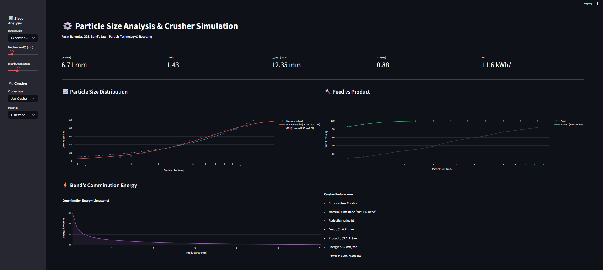
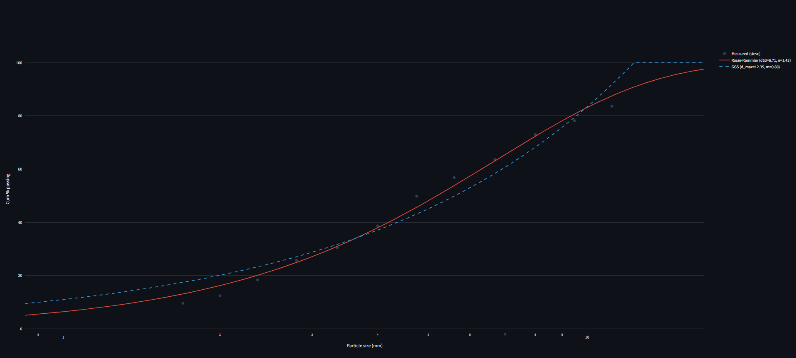
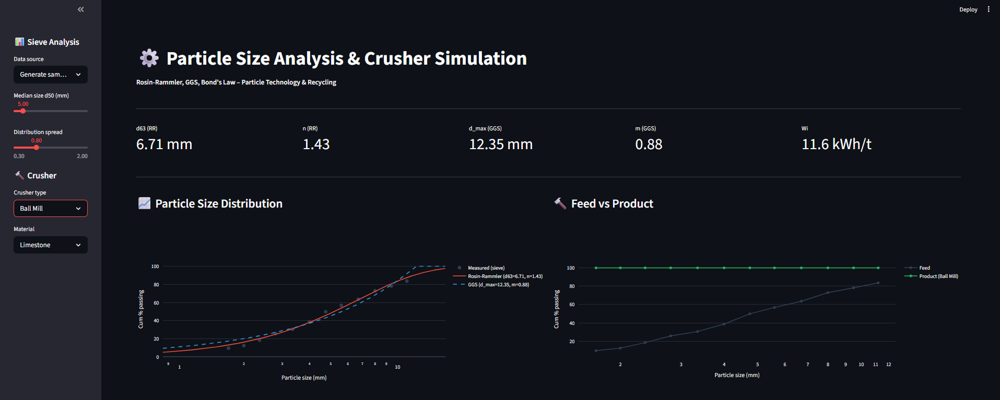
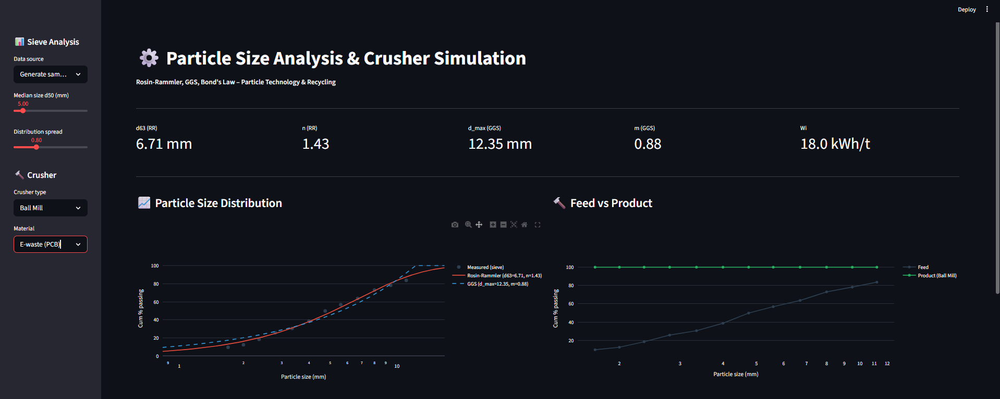

# ⚙️ Particle Size Analysis & Crusher Simulation
 

 
## Overview
Particle size distribution analysis + crusher simulation.
Fits Rosin-Rammler and GGS models. Simulates jaw/cone/ball mill.
Calculates Bond's comminution energy for 10 materials including
recycling streams.
 
## 🔗 Live Demo
**[Open Tool](https://your-url.streamlit.app)**
 
## Features
- Rosin-Rammler and GGS model fitting
- 3 crusher types: jaw, cone, ball mill
- Bond's Law energy for 10 materials
- Includes recycling: E-waste PCB, concrete, glass
- Feed vs product PSD comparison
- Manual data entry mode
 
### PSD Curve Fitting

 
### Ball Mill vs Jaw Crusher

 
### E-waste Recycling Energy

 
## Author
**Oscar Vincent Dbritto**
